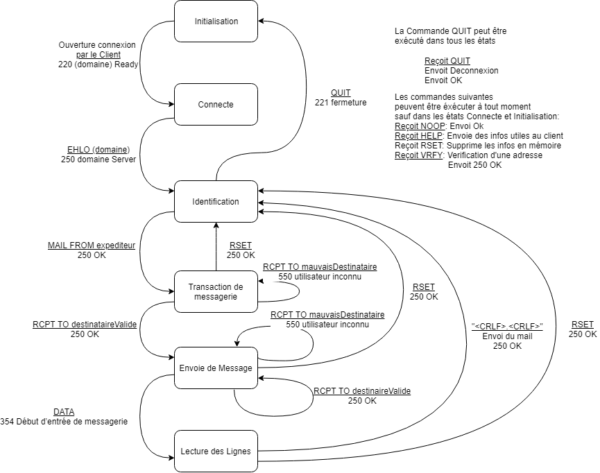

# Rapport IPC

**Etudiants :**
*  JACOUD Bastien
*  REMOND Victor
*  TAGUEJOU Christian
*  TARDY Martial

## I - Introduction
Suite du TP de développement d'un couple client/serveur mail.
Durant les étapes précédentes, nous avons d'abord dû mettre en place  
Le but de cette partie du TP était d

## II - Client

### 1 - Automate

### 2 - Backend

### 3 - Frontend


## III - Serveur
Avant de commencer l'implémentation du Serveur, nous avons réalisé l'automate de celui-ci 
.
Pour le développement SMTP, nous nous sommes servi de ce que nous avions fait pour POP3, donc la structure du projet est similaire.
Dans le main, nous avons défini une boucle infini pour que le serveur puisse accepter toutes les connexions tant que celles-ci se font sur le bon port. Le serveur étant concurrent, lorsqu'un client se connectera sur le port, un thread sera créé dans la classe Tcp pour lui permettre de communiquer avec le serveur.
Le client ainsi connecté se verra attribuer une instanciation de la classe ObjetSmtpConnecte. Cette classe est chargé de faire respecté l'automate du serveur. Il recevra les commandes de l'utilisateur et retournera les résultats grâce aux méthode receive() et send() de la classe Tcp. 

Les messages d'erreurs et de confirmation que peuvent envoyer le serveur sont stockés dans la classe ReponseServeur.
```java
public class ReponseServeur {

    public final static String SMTP_SERVER_READY = "220 Simple Mail Transfer Service Ready";
    public final static String SMTP_500_UNKNOWN_COMMAND = "500 Erreur de syntaxe, commande non reconnue";
    public final static String SMTP_250_SERVERDOMAIN = "250 localhost";
    public final static String SMTP_221_CLOSING = "221 fermeture";
    public final static String SMTP_250_OK = "250 OK";
    public final static String SMTP_550_UNKNOWN_USER = "250 utilisateur inconnu";
    public final static String SMTP_354_START_READING = "354 debut de lecture";
    /* Etat */
    public final static String SERVER_READY = "Initialisation";
    public final static String SERVER_CONNEXION = "Connexion";
    public final static String SERVER_IDENTIFICATION = "Identification";
    public final static String SERVER_TRANSACTION = "Transaction de Messagerie";
    public final static String SERVER_ENVOIE = "Envoie de Message";
    public final static String SERVER_LECTURE = "Lecture des Lignes";

    public final static String SMTP_CRLF = "\\r\\n";
}
```
Comme dit plus haut, la classe ObjetSmtpConnecte va permettre la communication entre le client et le serveur. Afin de pouvoir traiter toutes les requêtes de l'utilisateur, l'ensemble des traitements possibles est contenue dans une boucle 'while(true)' qui ne s'arretera que lorsque l'utilisateur émettra une requête QUIT.
Dans un premier temps, on commence par initialiser l'état du serveur comme c'est marqué dans l'automate. Ensuite, on recupère la commande et les paramètres envoyés par le client. Selon l'état du serveur, la méthode correspondante sera appelé et prendra en paramètre les informations envoyées par l'utilisateur.
```java
            switch (etatServeur) {
                case SERVER_CONNEXION:
                    reponseServeur = this.connexion(command, parameters);
                    break;
                case SERVER_IDENTIFICATION:
                    reponseServeur = this.identification(command, parameters);
                    break;
                case SERVER_TRANSACTION:
                    reponseServeur = this.transaction(command, parameters);
                    break;
                case SERVER_ENVOIE:
                    reponseServeur = this.envoie(command, parameters);
                    break;
                case SERVER_LECTURE:
                    reponseServeur = this.lecture(command, parameters);
                    break;
                default:
                    reponseServeur = SMTP_500_UNKNOWN_COMMAND;
            }
```
Chaque état a un ensemble de commande qui est possible d'éxécuter. Par exemple, dans l'état Identification, il sera possible pour l'utilisateur d'utiliser les commandes MAIL, RSET et QUIT.
```java
    private String identification(String command, String[] parameters) {
        switch (command){
            case "MAIL":
                return commandeMailFrom(parameters);
            case "QUIT":
                return commandeQuit();
            case "RSET":
                return commandeRset();
            default :
                return SMTP_500_UNKNOWN_COMMAND;
        }
    }
```
Si l'utilisateur envoie la commande QUIT, la méthode commandeQuit() va s'exécuter. Le booléen continuer devient false ce qui va entrainer l'arret de la boucle "while". Le serveur va se mettre dans l'état d'initialisation et va retourner à l'utilisateur un message de fermeture.
```java
    private String commandeQuit() {
        continuer = false;
        etatServeur = SERVER_READY;
        return SMTP_221_CLOSING;
    }
```
Lorsque le traitement est fini, on utilise la méthode send() de la connexion tcp du client pour lui renvoyer la réponses:
```java
    tcp.send(reponseServeur);
```
L'ensemble des commandes fonctionnent de la même manière.
## IV - Conclusion
